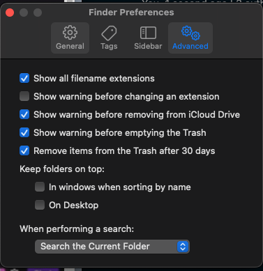
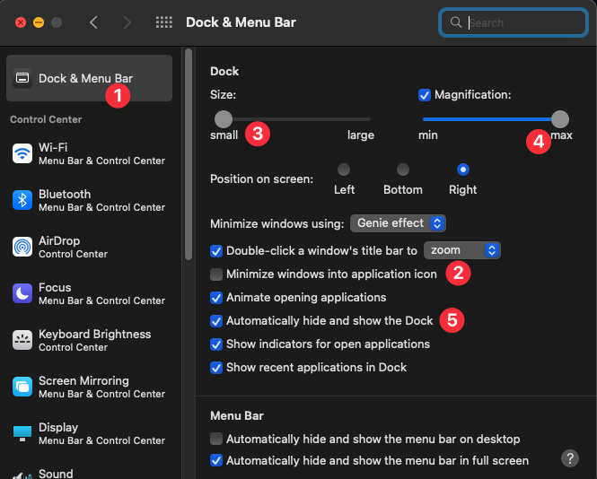
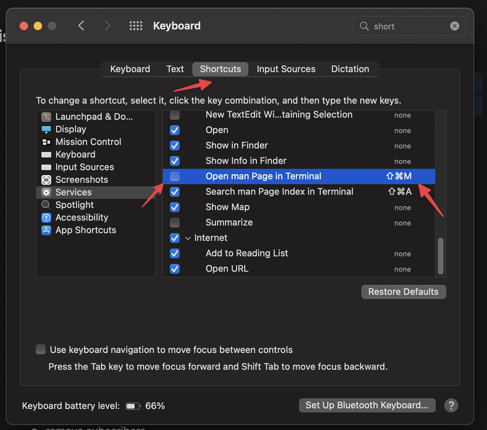

# dotfiles and settings

## 2023:

New computer setup flow:

- ### Mac
- Change finder's default location to home, and show all files and filename extensions , and show path bar,
- on sidebar don't show hard drives, and show external disks, and hide tags:

  

- Completely get rid of the dock:

  ddd

- Change input source keybindings to OPTN+,
- Connect logi mouse (bluetooth).
- Change tracking speed (tackpad and mouse).
- Automatically hide mac's dock.
- Configure Hotcorners - top left show desktop.
- Install brew (will take a long time).
- Disable the shortcut CMD SHFT M (by default opens terminal):
  
- Enable repeat keys on keydown:
  ~ defaults write -g ApplePressAndHoldEnabled -bool false

- ### Arc
- Use Safari to download Arc.
- Set Arc as default browser.
- Change settings for toggle sidebar to CMD+B.Move to split view other tab CMD+]
- Disable CMD OPTN N to open mini Arc (conflicts with new folder in VSCode).

- Download flux: https://justgetflux.com/

- Download rectangle and enable.

- Download CleanShot.

- Download alt-tab: `brew install alt-tab`

- ### Raycast setup:
- Download Raycast.
- #### key extenssions:

1. Linear
2. TODOist
3. GTranslate
4. Timers

- Set Raycast instead of Spotlight.
- #### Raycast Key bindings:

1. Linear - create issue: CMD CTRL OPTN =
2. Search emoji - SHFT CMD OPTN E + SHFT CMD OPTN W
3. Create task - TODOist - SHFT CMD OPTN T
4. Search Issues - Linear - CNTRL OPTN CMD - (minus)
5. Upcoming tasks TODOist - SFHT CMD OPTN 1

- Download Shift and sign in to all accounts.

- Download Zoom and sign in.

- Download Krisp and sign in.

- Download Notion and sign in.

- ### Notion:

7. Sign in with Novu and Personal, then change to system theme.

- ### Download iTerm
- For setup I just follow: https://www.josean.com/posts/terminal-setup
- Change font size to 18.
  oh-my-zsh TDLR:
- instsall oh my zsh:
- `sh -c "$(curl -fsSL https://raw.githubusercontent.com/ohmyzsh/ohmyzsh/master/tools/install.sh)"`
- Download and use .zshrc file:
  https://github.com/oba2311/dotfiles/blob/main/.zshrc

- install powerlevel10k
- install autocomplete for zsh and syntax highlighting.

- VIM:
- install plugins this way: https://opensource.com/article/20/2/how-install-vim-plugins
- FZF https://github.com/junegunn/fzf#using-homebrew
- https://sourabhbajaj.com/mac-setup/iTerm/fzf.html

- Use this .vimrc:
- https://github.com/oba2311/dotfiles/blob/main/.vimrc

### VSCode:

- Sync extenssions. Sign in with github.
- Use CMD SHFT P and search "path" to install `code` into `PATH`.
- Install and give permissions to VSCode project manager in Raycast.
- Download Git for laptop through the Gitlens extenssion CTA.
- Set up Personal Access Token for Gitlens: https://docs.github.com/en/github/authenticating-to-github/creating-a-personal-access-token
- https://stackoverflow.com/questions/68775869/message-support-for-password-authentication-was-removed-please-use-a-personal

- Install Vim through brew.

13. ### Download and change theme:
14. Figma
15. Linear
16. Descript
17. Todoist
18. Shift

### Mouse:

- Change mouse tracking speed to move faster for trackpad.
- Connect logitech mouse - MX Vertical for better posture.
- Install logitech options to set up mouse buttons:
- Faster pointer speed.

## IMPORTANT before killing a laptop:

- Export current stuff in Excalidraw.

For more info, check out [the blog post](https://www.josean.com/posts/terminal-setup).
and [this vide:](https://www.youtube.com/watch?v=2_ZbslLnshw).
